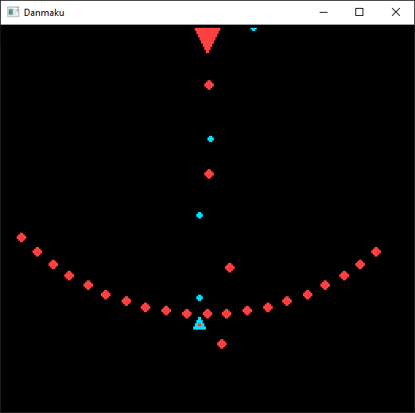

# Danmaku

Author: Jingguo Liang (jingguol@andrew.cmu.edu)

Design: A bullet-hell (not quite because of sprite number limitation) game with ability to teleport yourself

Screen Shot:

How Your Asset Pipeline Works:

There are two asset files: one for the palettes and the other for the tiles. They are binary files that can be directly copied into vectors of uint8_t values.

I tried to use the provided Loat<T> function but failed. So I just opened the files and manually copied the content out.

How To Play:

Use arrow keys to move. Hold Lshift and use arrow keys to move the teleport marker, then release Lshift to perform the teleport. Hit the enemy 100 times to win.

The game does not yet have a winning/losing page. It will just quit on either situation.

This game was built on Windows.

This game was built with [NEST](NEST.md).

